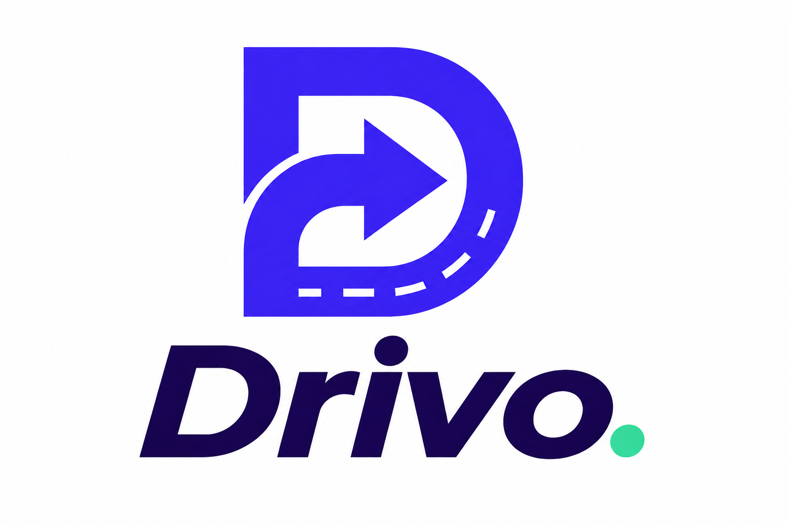
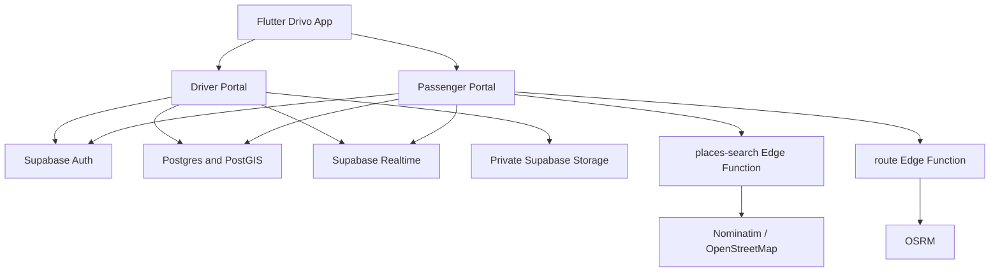

<p align="center">
  
</p>

<h1 align="center">Drivo</h1>

<p align="center">
  A full-stack ride-hailing application built with Flutter, Supabase, PostGIS, OpenStreetMap and OSRM.
</p>

<p align="center">
  <strong>Passenger booking • Driver onboarding • Realtime dispatch • Live tracking • Cash/QR payments • Earnings • Ratings</strong>
</p>

---

## Overview

Drivo is a single Flutter application with two fixed account experiences:

- **Passenger portal** — request rides, choose a vehicle category and payment method, track the assigned Driver, review trip history, and rate completed rides.
- **Driver portal** — complete verification onboarding, wait for approval, go online, receive ride requests, manage the trip lifecycle, review earnings and history, manage documents/payment QR, and view Passenger feedback.

The backend uses Supabase with Postgres/PostGIS, Row Level Security, Realtime subscriptions, private Storage buckets, database RPCs and Edge Functions.

> **Authentication note:** this portfolio build uses a unique 10-digit phone number as the user-facing identity without SMS/OTP verification. A production release should replace this with verified phone authentication or another secure identity provider.

## App screenshots

Screenshots are shown as compact thumbnails. Click any image to open the full-size version.

### Onboarding & account registration

<details open>
<summary><strong>Registration flow</strong></summary>
<br/>
<table>
  <tr>
    <td align="center">
      <a href="docs/screenshots/registration%20flow/app%20open.jpg"></a><br/>
      <sub><b>Phone sign-in</b></sub>
    </td>
    <td align="center">
      <a href="docs/screenshots/registration%20flow/choose.jpg"></a><br/>
      <sub><b>Account type</b></sub>
    </td>
    <td align="center">
      <a href="docs/screenshots/registration%20flow/passenger%20registration.jpg"></a><br/>
      <sub><b>Passenger registration</b></sub>
    </td>
  </tr>
  <tr>
    <td align="center">
      <a href="docs/screenshots/registration%20flow/driver%20registration.jpg"></a><br/>
      <sub><b>Driver registration</b></sub>
    </td>
    <td align="center">
      <a href="docs/screenshots/registration%20flow/driver%20application.jpg"></a><br/>
      <sub><b>Application review</b></sub>
    </td>
    <td></td>
  </tr>
</table>
</details>

### Passenger flow

<details open>
<summary><strong>Passenger experience</strong></summary>
<br/>
<table>
  <tr>
    <td align="center">
      <a href="docs/screenshots/passenger%20flow/passenger%20destination.jpg"></a><br/>
      <sub><b>Destination map</b></sub>
    </td>
    <td align="center">
      <a href="docs/screenshots/passenger%20flow/choose%20ride.jpg"></a><br/>
      <sub><b>Ride & payment</b></sub>
    </td>
    <td align="center">
      <a href="docs/screenshots/passenger%20flow/found%20driver.jpg"></a><br/>
      <sub><b>Assigned Driver</b></sub>
    </td>
  </tr>
  <tr>
    <td align="center">
      <a href="docs/screenshots/passenger%20flow/trip%20complete.jpg"></a><br/>
      <sub><b>Trip complete</b></sub>
    </td>
    <td align="center">
      <a href="docs/screenshots/passenger%20flow/rate%20ride.jpg"></a><br/>
      <sub><b>Driver rating</b></sub>
    </td>
    <td align="center">
      <a href="docs/screenshots/passenger%20flow/passenger%20profile.jpg"></a><br/>
      <sub><b>Profile & trip history</b></sub>
    </td>
  </tr>
</table>
</details>

### Driver flow

<details open>
<summary><strong>Driver experience</strong></summary>
<br/>
<table>
  <tr>
    <td align="center">
      <a href="docs/screenshots/driver%20flow/driver%20accept.jpg"></a><br/>
      <sub><b>Incoming request</b></sub>
    </td>
    <td align="center">
      <a href="docs/screenshots/driver%20flow/driver%20trip.jpg"></a><br/>
      <sub><b>Trip history</b></sub>
    </td>
    <td align="center">
      <a href="docs/screenshots/driver%20flow/driver%20earnings.jpg"></a><br/>
      <sub><b>Earnings</b></sub>
    </td>
  </tr>
  <tr>
    <td align="center">
      <a href="docs/screenshots/driver%20flow/driver%20feedback.jpg"></a><br/>
      <sub><b>Ratings & feedback</b></sub>
    </td>
    <td align="center">
      <a href="docs/screenshots/driver%20flow/driver%20profile.jpg"></a><br/>
      <sub><b>Verified Driver profile</b></sub>
    </td>
    <td></td>
  </tr>
</table>
</details>

## Current feature set

### Passenger

- Phone-first account lookup and registration
- Fixed Passenger account type
- GPS-based pickup location
- OpenStreetMap map experience
- Place search through a Supabase Edge Function
- Manual destination pinning
- OSRM route calculation
- Drivo Bike, Mini, Car and XL categories
- Server-calculated fares in NPR
- Cash and Online QR payment selection
- Realtime Driver assignment and ride-status updates
- Live Driver marker tracking while the Driver app is active
- Driver name, phone and vehicle details during the ride
- Detailed ride history with route, fare, distance and payment state
- One 1–5 star rating per completed, paid ride
- Optional written Driver feedback
- Passenger profile statistics
- Logout with confirmation

### Driver

- Fixed Driver account type
- Multi-step Driver registration
- Personal details, Driver photo, date of birth and address
- Driving-license information and document images
- Vehicle category, make, model, year, color and plate
- Registration, insurance and vehicle photos
- Private document storage
- Application states: pending / approved / rejected
- Approval required before going online
- Online/offline Driver presence
- Realtime GPS publishing while online
- Category-aware nearby dispatch
- Incoming requests with Passenger name and phone
- Accept/reject workflow
- Trip lifecycle: arriving → arrived → in progress → completed
- Cash and QR payment states
- Driver payment QR upload
- Earnings dashboard with Drivo service-fee calculation
- Detailed Driver trip history
- Verification documents in Driver profile
- Real average rating and rating count derived from rides
- Passenger feedback history
- Logout with confirmation

## Architecture



## Repository structure

```text
Drivo/
├── flutter/                 # Primary Flutter app: Passenger + Driver portals
│   ├── lib/main.dart
│   ├── assets/
│   ├── android/
│   └── ios/
├── supabase/
│   ├── migrations/          # Schema, RLS, RPCs, ratings and dispatch
│   ├── functions/
│   │   ├── places-search/   # Nominatim place-search proxy
│   │   └── route/           # OSRM routing proxy
│   ├── config.toml
│   └── seed.sql
├── scripts/dart/            # Development utilities
└── android/                 # Experimental native Android client
```

The Flutter application in `flutter/` is the primary product.

## Backend model

Important backend concepts include:

- `profiles` — core account identity and fixed Passenger/Driver type
- `driver_applications` — Driver verification/application data
- `drivers` — approved Driver operational state, location, rating and payment QR
- `vehicle_categories` — Bike/Mini/Car/XL pricing configuration
- `ride_requests` — realtime dispatch offers before a Driver accepts
- `rides` — accepted trips, route/fare/payment snapshots and ratings

### Business rules enforced on the backend

The Flutter UI is not trusted for authorization. Database policies and RPCs enforce rules such as:

- Passenger accounts cannot perform Driver operations.
- Driver accounts cannot request Passenger rides.
- A Driver must be approved before going online.
- Dispatch only considers approved, online and available Drivers in the requested category.
- QR rides require a Driver payment QR.
- Only the Passenger from a completed, paid ride can rate that Driver.
- A ride can be rated only once.
- Driver averages are derived from actual ride ratings.

## Maps, routing and location

Drivo uses:

- **Map tiles:** OpenStreetMap via `flutter_map`
- **Place search:** Nominatim through the `places-search` Edge Function
- **Routing:** OSRM through the `route` Edge Function
- **Spatial queries:** PostGIS
- **Device GPS:** `geolocator`

While a Driver is online and the app is active, location updates are written to Supabase and reflected on the Passenger map using Realtime.

### Known location limitation

Production-grade background Driver location tracking is not yet implemented. If the Driver app is killed or heavily background-restricted by the OS, continuous tracking is not guaranteed. Smooth marker interpolation is also future work.

## Payments

Drivo currently supports two portfolio payment paths:

- **Cash** — marked paid when the Driver completes the trip.
- **Online QR** — the Driver uploads a QR image; the Passenger can use it after the trip and confirms payment in Drivo.

This is a workflow simulation rather than a payment-gateway integration. No banking credentials or payment-provider secrets are stored by the project.

## Driver ratings

Driver ratings are linked to individual rides. A rating is accepted only when:

1. the caller is the ride's Passenger,
2. the ride is completed,
3. payment is marked paid,
4. the ride has not already been rated,
5. the rating is between 1 and 5 stars.

The Driver's displayed average and rating count are recalculated from rated trips.

## Requirements

- Flutter SDK compatible with Dart `>=3.6.0 <4.0.0`
- Android Studio / Android SDK for Android development
- Xcode for iOS development
- A Supabase project for backend hosting
- Supabase CLI for local backend development

## Run the Flutter app

```bash
git clone https://github.com/abhishekldev07/Drivo.git
cd Drivo/flutter
flutter pub get
flutter analyze
flutter run
```

To point the app at another Supabase project, override the compile-time values:

```bash
flutter run \
  --dart-define=SUPABASE_URL=https://YOUR_PROJECT.supabase.co \
  --dart-define=SUPABASE_PUBLISHABLE_KEY=YOUR_PUBLISHABLE_KEY
```

Never put a Supabase service-role key or another server secret inside the Flutter app.

## Supabase development

From the repository root:

```bash
supabase start
supabase db reset
```

The migrations under `supabase/migrations/` define the backend schema and security model.

## Driver approval workflow

1. Register a Driver account in the app.
2. Complete the requested personal, vehicle and document information.
3. Open Supabase Dashboard.
4. Review the row in `driver_applications` and the private Storage documents.
5. Set the application status to `approved` or `rejected`.
6. Approved Drivers receive access to the operational Driver portal.

## Security notes

- RLS is enabled on exposed application tables.
- Private Driver documents and payment QR files use Supabase Storage policies.
- Privileged marketplace operations run through validated RPCs using `auth.uid()` ownership checks.
- The Flutter app uses only a client-side Supabase publishable key.
- Service-role keys, provider secrets, signing keys and local environment files must never be committed.
- The repository `.gitignore` excludes common local credentials, build output and Supabase local state.

### Important authentication limitation

The current phone-only sign-in/handoff mechanism does not verify possession of the entered number. Before a real launch, replace it with verified authentication and review the account-handoff flow accordingly.

## Testing checklist

```bash
cd flutter
flutter clean
flutter pub get
flutter analyze
flutter test
```

Recommended manual checks include Passenger and Driver registration, duplicate-phone protection, Driver approval, online/offline presence, category matching, accept/reject, realtime location movement, full trip lifecycle, Cash/QR payments, trip history, Driver earnings and ratings.

## GitHub hygiene

Before pushing:

```bash
git status
```

Do not commit:

- `flutter/android/local.properties`
- `.env` files
- Supabase `.temp/` or `.branches/`
- signing keys / keystores
- service-role or secret keys
- build output such as `build/`, APK, AAB or IPA files

`pubspec.lock` should remain committed for reproducible application builds.

## Roadmap

- verified phone authentication / OTP for a production release
- background Driver location service
- push notifications for ride offers and status changes
- smooth car-marker interpolation
- real payment-gateway integration
- dedicated admin/operations dashboard
- government/document verification integrations
- Passenger/Driver support or chat flows
- automated integration tests and CI
- Play Store / App Store deployment hardening

## Project status

Drivo is a portfolio/demo product designed to demonstrate marketplace architecture, realtime state, geospatial dispatch, role-based workflows and polished mobile UX.

## License

No open-source license is included. Unless a license is added by the repository owner, the source code is not granted for redistribution or commercial reuse.
