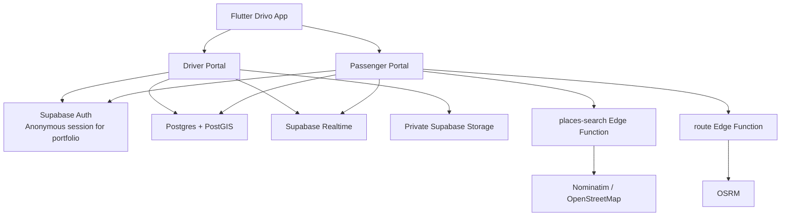

<p align="center">
  
</p>

<h1 align="center">Drivo</h1>

<p align="center">
  A full-stack ride-hailing portfolio application built with Flutter, Supabase, PostGIS, OpenStreetMap and OSRM.
</p>

<p align="center">
  <strong>Passenger booking • Driver onboarding • Realtime dispatch • Live tracking • QR/cash payments • Earnings • Ratings</strong>
</p>

---

## Overview

Drivo is a single Flutter application with two fixed account experiences:

- **Passenger portal** — request rides, choose vehicle category and payment method, track the assigned driver, view ride history, and rate completed trips.
- **Driver portal** — complete verification onboarding, wait for approval, go online, receive and respond to ride requests, run the trip lifecycle, review earnings/history, manage documents and payment QR, and view passenger ratings.

The backend is powered by Supabase with Postgres/PostGIS, Row Level Security, Realtime subscriptions, private Storage buckets, database RPCs and Edge Functions.

> **Portfolio authentication note:** this project intentionally uses a 10-digit phone number as the user-facing identity without SMS/OTP verification. That keeps the demo fast and inexpensive, but it is **not suitable as production authentication**. A real release should replace the phone-handoff flow with verified phone authentication or another secure identity provider.

## Current feature set

### Passenger

- Phone-first account lookup and registration
- Fixed Passenger account type
- GPS-based pickup location
- OpenStreetMap map experience
- Place search through a Supabase Edge Function
- Manual destination pinning
- OSRM route calculation
- Vehicle categories:
  - Drivo Bike
  - Drivo Mini
  - Drivo Car
  - Drivo XL
- Server-calculated fares in NPR
- Cash and Online QR payment selection
- Realtime driver assignment and ride status updates
- Live driver marker tracking while the Driver app is active
- Driver information during the ride
- Polished ride history with:
  - pickup and destination
  - date/time
  - fare and distance
  - driver name, phone and vehicle
  - payment method/status
  - rating status
- One rating per completed, paid ride
- Optional written rating feedback
- Passenger profile statistics
- Logout with confirmation

### Driver

- Fixed Driver account type
- Multi-step Driver registration
- Personal information and 10-digit phone identity
- Driver photo
- Date of birth and address
- Driving-license details and images
- Vehicle category selection
- Vehicle make/model/year/color/plate
- Registration, insurance and vehicle photos
- Private document storage
- Application states: pending / approved / rejected
- Manual approval through Supabase Dashboard
- Driver dashboard with online/offline presence
- Realtime GPS publishing while online
- Category-aware nearby dispatch
- Incoming request UI with Passenger name and phone
- Accept/reject workflow
- Trip lifecycle:
  - driver arriving
  - driver arrived
  - trip in progress
  - completed
- Cash and QR payment states
- Driver payment QR upload
- Earnings dashboard
- 10% Drivo service-fee calculation
- Trip history with fare/fee/net earning breakdown
- Driver profile and verification documents
- Real average rating and rating count calculated from completed rides
- Passenger feedback history
- Logout with confirmation

## Architecture



## Repository structure

```text
Drivo/
├── flutter/                 # Primary Flutter app (Passenger + Driver portals)
│   ├── lib/main.dart
│   ├── assets/
│   ├── android/
│   └── ios/
├── supabase/
│   ├── migrations/          # Database schema, RLS, RPCs, ratings, dispatch
│   ├── functions/
│   │   ├── places-search/   # Nominatim place search proxy
│   │   └── route/           # OSRM route proxy
│   ├── config.toml
│   └── seed.sql
├── scripts/dart/            # Development utilities
└── android/                 # Experimental native Android client
```

The Flutter application in `flutter/` is the primary product.

## Backend model

Important backend concepts include:

- `profiles` — core account identity and fixed Passenger/Driver type
- `driver_applications` — Driver verification/application data
- `drivers` — approved Driver operational state, location, rating and payment QR
- `vehicle_categories` — Bike/Mini/Car/XL pricing configuration
- `ride_requests` — realtime dispatch offers before a Driver accepts
- `rides` — accepted trips, route/fare/payment snapshots and ratings

### Business rules enforced on the backend

The Flutter UI is not trusted for authorization. Database policies/RPCs enforce rules such as:

- Passenger accounts cannot act as Drivers.
- Driver accounts cannot request Passenger rides.
- A Driver must be approved before going online.
- Dispatch only considers approved, online, available Drivers in the requested category.
- QR rides require a Driver payment QR.
- Only the Passenger who completed and paid for a ride can rate that Driver.
- A ride can be rated only once.
- Driver average ratings are derived from completed-ride ratings.

## Maps, routing and location

Drivo intentionally avoids Google Maps billing for this portfolio build:

- **Map tiles:** OpenStreetMap via `flutter_map`
- **Place search:** Nominatim through `places-search`
- **Routing:** OSRM through `route`
- **Spatial queries:** PostGIS
- **Device GPS:** `geolocator`

While a Driver is online and the app is active, location updates are written to Supabase and reflected on the Passenger map using Realtime.

### Known location limitation

Production-grade background location tracking is not yet implemented. If the Driver app is killed or heavily background-restricted by the OS, continuous tracking is not guaranteed. Smooth marker interpolation is also a future polish item.

## Payments

Drivo currently supports two portfolio payment paths:

- **Cash** — marked paid when the Driver completes the trip.
- **Online QR** — the Driver uploads a QR image; the Passenger can use it after the trip and confirms payment in Drivo.

This is a workflow simulation, not a real payment-gateway integration. No banking credentials or payment-provider secrets are stored by the project.

## Driver ratings

Driver ratings are tied to individual rides.

A rating is accepted only when:

1. the caller is the ride's Passenger,
2. the ride is completed,
3. payment is marked paid,
4. the ride has not already been rated,
5. the rating is between 1 and 5 stars.

The Driver's displayed average and rating count are recalculated from actual rated trips.

## Requirements

- Flutter SDK compatible with Dart `>=3.6.0 <4.0.0`
- Android Studio / Android SDK for Android development
- Xcode for iOS development
- A Supabase project for backend hosting
- Supabase CLI if running the backend locally

## Run the Flutter app

```bash
git clone <your-repository-url>
cd Drivo/flutter
flutter pub get
flutter analyze
flutter run
```

The current source includes a public Supabase project URL/publishable key fallback for the portfolio backend. A Supabase **publishable key is client-side by design**, but never place a service-role/secret key in the Flutter app.

To point the app at another Supabase project, override the compile-time values:

```bash
flutter run \
  --dart-define=SUPABASE_URL=https://YOUR_PROJECT.supabase.co \
  --dart-define=SUPABASE_PUBLISHABLE_KEY=YOUR_PUBLISHABLE_KEY
```

## Supabase development

Install the Supabase CLI, then from the repository root:

```bash
supabase start
supabase db reset
```

The migrations under `supabase/migrations/` define the backend schema and security model.

Edge Functions can be served locally with the Supabase CLI as needed.

## Driver approval workflow

The portfolio build does not include a separate admin dashboard yet.

1. Register a Driver account in the app.
2. Complete all requested Driver/vehicle documents.
3. Open Supabase Dashboard.
4. Review the row in `driver_applications` and the private Storage documents.
5. Set the application status to `approved` or `rejected`.
6. Approved Drivers receive access to the Driver portal.

## Security notes

- RLS is enabled on exposed application tables.
- Private Driver documents and payment QR files use Supabase Storage policies.
- Privileged marketplace operations run through validated RPCs using `auth.uid()` ownership checks.
- The Flutter app uses only a publishable Supabase key.
- Service-role keys, provider secrets, signing keys and local environment files must never be committed.
- The repository `.gitignore` excludes common local credentials, build output and Supabase local state.

### Important portfolio limitation

The phone-only sign-in/handoff mechanism is intentionally insecure compared with real authentication because possession of the phone number is not verified. Before any real launch, replace this with verified OTP/authentication and review the account-handoff RPC accordingly.

## Testing checklist

Before presenting or publishing a new build, verify at minimum:

```bash
cd flutter
flutter clean
flutter pub get
flutter analyze
flutter test
```

Recommended manual end-to-end checks:

- Passenger registration and login
- Driver registration and approval
- duplicate-phone protection
- Driver online/offline
- category matching
- request accept/reject
- live location movement
- complete trip lifecycle
- Cash payment
- QR payment
- Passenger ride history
- Driver trip/earnings history
- Driver rating submission
- logout/login with active ride restoration

## GitHub hygiene

Before pushing:

```bash
git status
```

Confirm that you are **not** committing:

- `flutter/android/local.properties`
- `.env` files
- Supabase `.temp/` or `.branches/`
- signing keys / keystores
- service-role or secret keys
- build output (`build/`, APK/AAB/IPA files)

`pubspec.lock` should stay committed for this application repository to keep dependency resolution reproducible.

## Roadmap / production gaps

Potential future work:

- verified phone authentication / OTP
- background Driver location service
- push notifications for ride offers/status changes
- smooth car-marker interpolation
- real payment gateway integration
- dedicated admin/operations dashboard
- real government/document verification integrations
- Passenger-to-Driver support/chat flows
- automated integration tests and CI
- Play Store / App Store deployment hardening

## Project status

Drivo is a **portfolio/demo product**, not a production transportation service. It is designed to demonstrate marketplace architecture, realtime state, geospatial dispatch, role-based workflows and a polished mobile UX.

## License

No open-source license is included. Unless a license is added by the repository owner, the source code is not granted for redistribution or commercial reuse.
